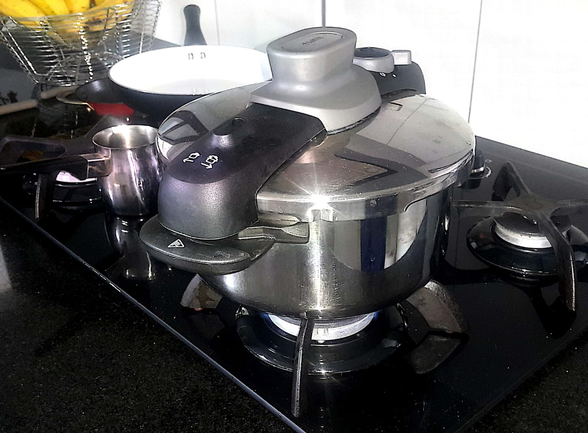
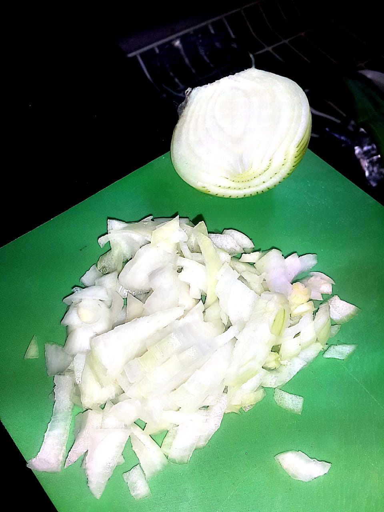
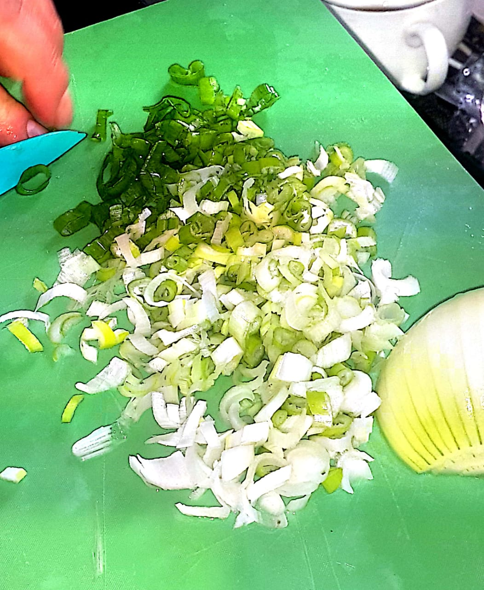
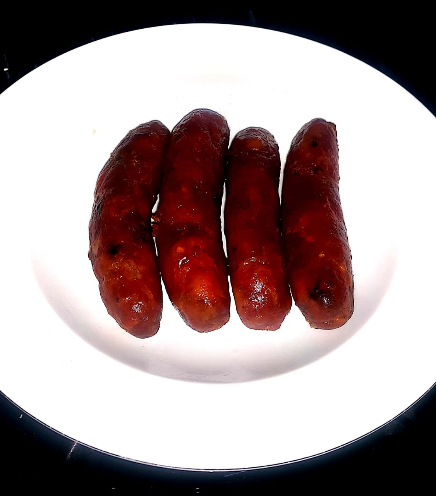
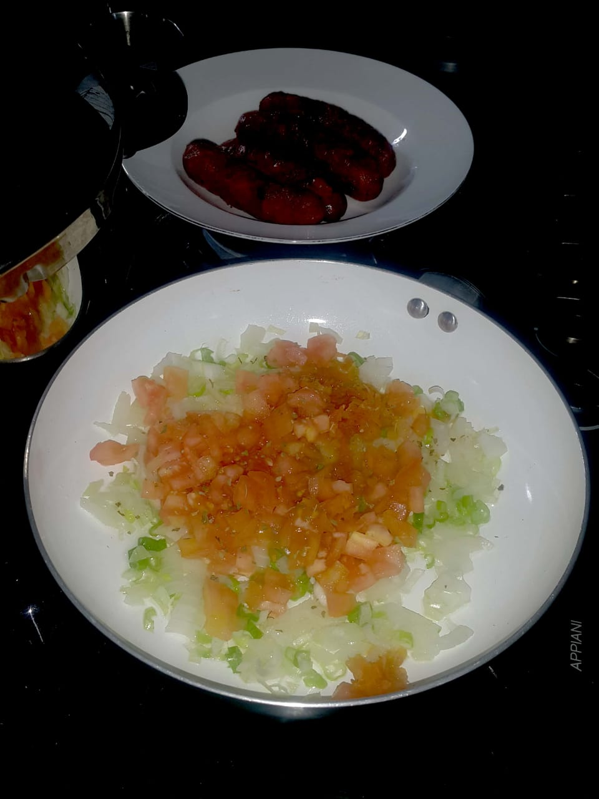
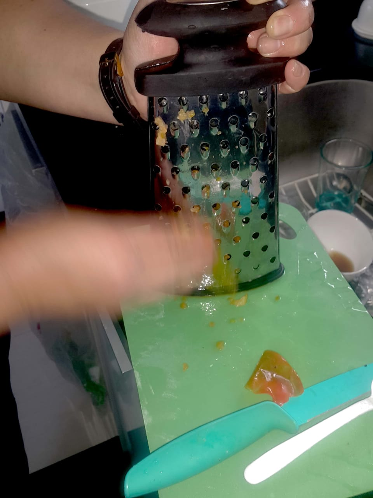
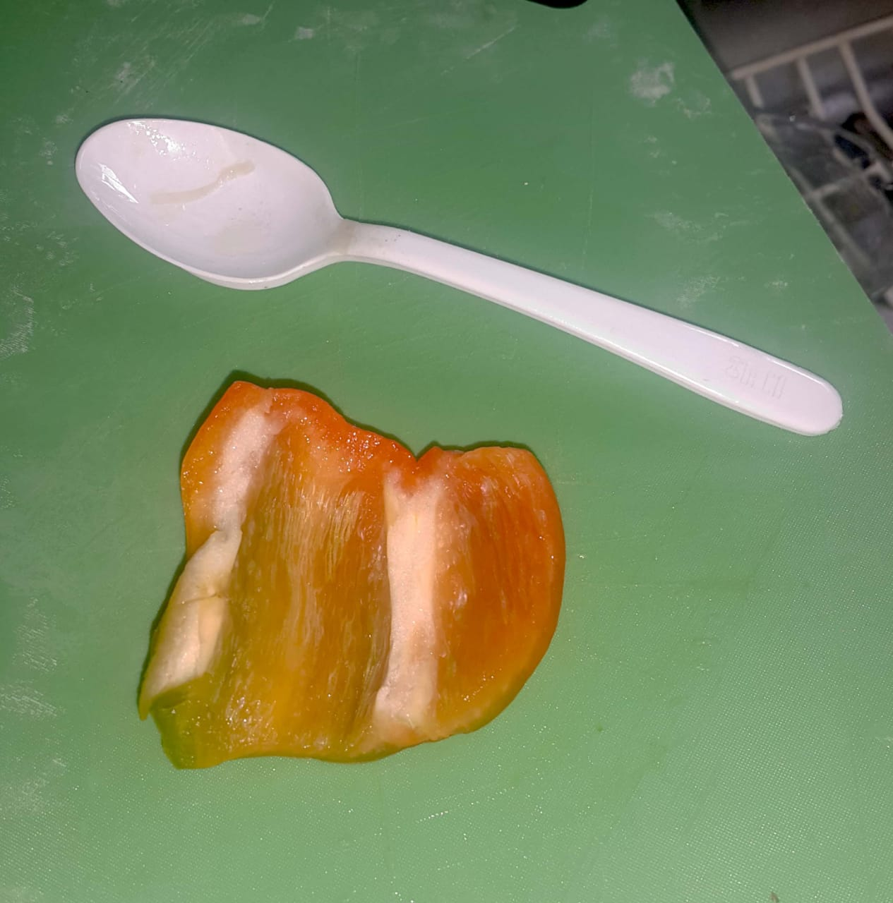
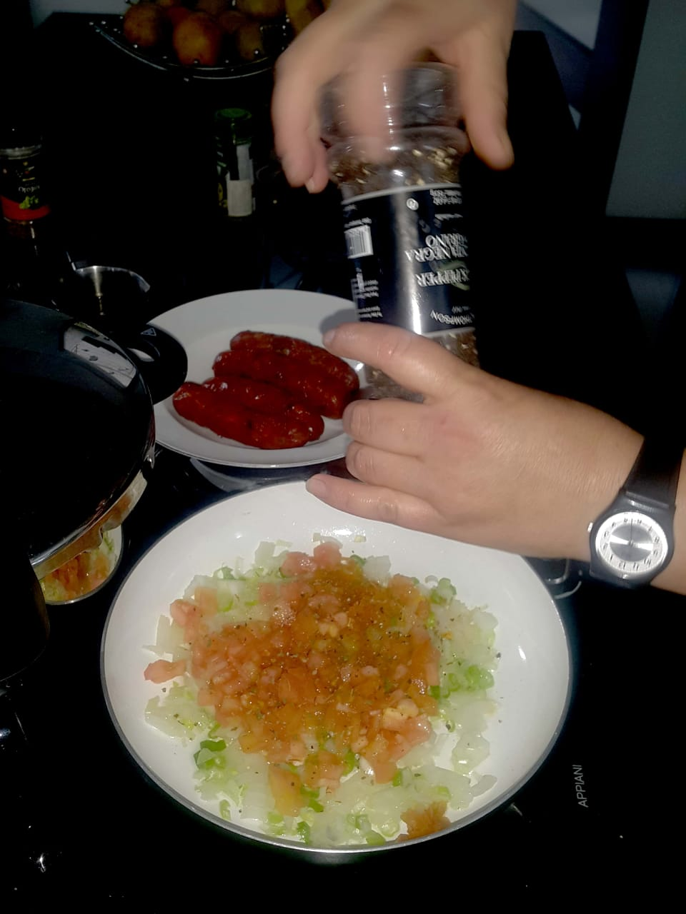

## Ingredientes

| Ingrediente      | Cantidad para 6 personas |
| :------          | :---                     |
| Lentejas         | 320 gramos               |
| Papas            | 3                        |
| Sal              | Al gusto                 |
| Cebolla de huevo | 1.5                      |
| Cebolla larga    | 1.5                      |
| Agua             | 1.5 litros               |
| Ajo              | 2                        |
| Pimienta         | Al gusto                 |
| Orégano          | Al gusto                 |
| Romero           | Al gusto                 |
| Laurel           | Al gusto                 |
| Tomillo          | Al gusto                 |
| Aceite           | 2 cucharadas             |
| Carne molida     | 1 kilo                   |
| Pimentón         | 1/8                      |
| Tomate           | 1                        |

## Preparación

### Lentejas
- Verter el agua y las lentejas en la olla pitadora.
- Poner a fuego alto.
- Añadir una cucharada mediana de sal a la olla.
- Añadir una cucharadita de pimienta, orégano, romero, laurel y tomillo.
- Pelar las papas, lavarlas, y luego partirlas en cubos de tamaño mediano.
- Añadir las papas a la olla.
- Bajar a fuego medio luego de que el agua hierva.
- Picar media cebolla de huevo y larga en cubitos finos y añadirlos.
- Esperar a que el agua se torne café.
- En este momento se puede empezar a preparar las albóndigas.
- Cuando el agua se ponga café, tapar la olla.
- Esperar hasta que la olla comience a pitar (aproximadamente 15 minutos).
- Mientras esperamos que la olla pite, preparar el guiso.
- Dejar pitar durante 10 minutos y apagar el fuego.

### Albóndigas
- Picar media cebolla de huevo y larga en cubitos finos y mezclarlas con la carne molida.
- Añadir la sal y los aliños a la carne.
- Armar las albóndigas y adicionarlas a la olla.

### Guiso
- Alistar un perol para sofreír el guiso.
- Picar media cebolla de huevo y larga en cubitos y añadirla al perol.
- Pelar un tomate y picarlo en cubitos finos.
- Rayar el pimentón para quitarle la cáscara.
- Verter 2 cucharadas de aceite.
- Añadir sal, pimienta, y aliños secos.
- Mezclar todos los ingredientes en el perol.
- Tapar el perol y cocinar a fuego medio durante 5 minutos.
- Macerar el guiso al destapar el perol.
- Añadir el guiso a la olla pitadora y prender a fuego alto hasta que hierva.
- Bajar el fuego a medio cuando hierva y esperar otros 5 minutos.
- Apagar el fuego.

 |  
 | 
 | 
 | 

<!-- {: .box-note} -->
<!-- **Note:** This is a notification box. -->

<!-- {: .box-warning} -->
<!-- **Warning:** This is a warning box. -->

<!-- {: .box-error} -->
<!-- **Error:** This is an error box. -->

