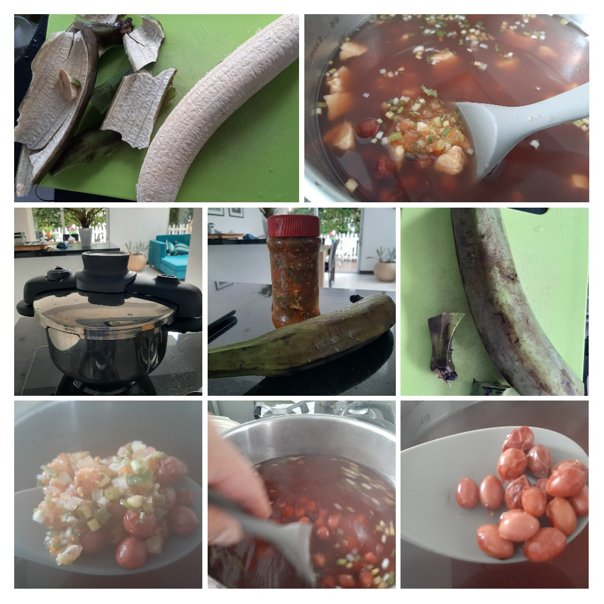
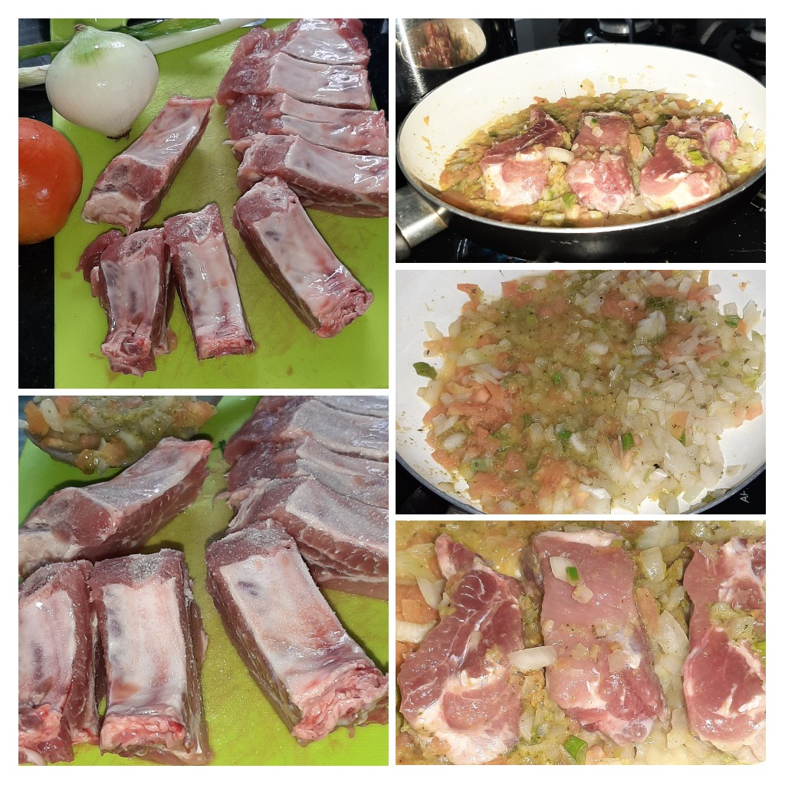

## Ingredientes

| Ingrediente        | Cantidad para 6 personas |
| :------            | :---                     |
| Fríjoles           | 320 gramos               |
| Plátano            | 1                        |
| Sal                | Al gusto                 |
| Cebolla de huevo   | 1                        |
| Cebolla larga      | 1                        |
| Agua               | 2 litros                 |
| Ajo                | 1                        |
| Pimienta           | Al gusto                 |
| Orégano            | Al gusto                 |
| Romero             | Al gusto                 |
| Laurel             | Al gusto                 |
| Tomillo            | Al gusto                 |
| Costilla de cerdo  | 500 gramos               |
| Pimentón           | 1/8                      |
| Tomate             | 1                        |
| Cubo de Knor/Maggi | 1/4                      |

## Preparación

### Fríjoles
- Verter el agua y los fríjoles en la olla pitadora.
- Poner a fuego alto.
- Añadir una cucharada mediana de sal a la olla y un cuarto de cubo Knor/Maggi.
- Añadir una cucharadita de pimienta, orégano, romero, laurel y tomillo.
- Bajar a fuego medio luego de que el agua hierva y tapar la olla a presión.
- Esperar hasta que la olla comience a pitar (aproximadamente después de 15 minutos).
- Mientras se espera que la olla pite, pelamos el plátano y lo picamos en cuadritos, y preparamos el guiso (mirar abajo).
- Dejar que la olla pite durante 10 minutos y apagar el fuego.

### Costilla
- Rayar media cebolla de huevo y larga y mezclarlas con la costilla.
- Añadir la sal y los aliños a la costilla.
- Cortar la costilla en trozos medianos.
- Sofreír la costilla en un perol con una cucharada de aceite a fuego lento.

### Guiso
- Alistar un perol para sofreír el guiso.
- Picar media cebolla de huevo y larga en cubitos y añadirla al perol.
- Pelar un tomate y picarlo en cubitos finos.
- Rayar el pimentón para quitarle la cáscara.
- Verter 2 cucharadas de aceite.
- Añadir sal, pimienta, y aliños secos.
- Mezclar todos los ingredientes en el perol.
- Tapar el perol y cocinar a fuego medio durante 5 minutos.
- Macerar el guiso al destapar el perol.
- Añadir el guiso a la olla pitadora y prender a fuego alto hasta que hierva (sin tapar la olla).
- Bajar el fuego a medio cuando hierva y esperar otros 5 minutos.
- Apagar el fuego.

<!-- {: .box-note} -->
<!-- **Note:** This is a notification box. -->

<!-- {: .box-warning} -->
<!-- **Warning:** This is a warning box. -->

<!-- {: .box-error} -->
<!-- **Error:** This is an error box. -->

